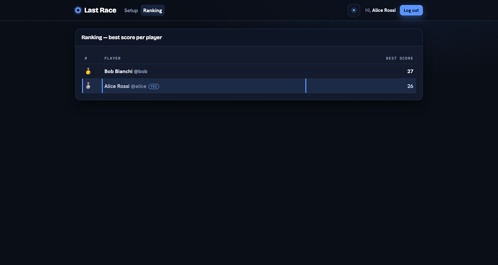
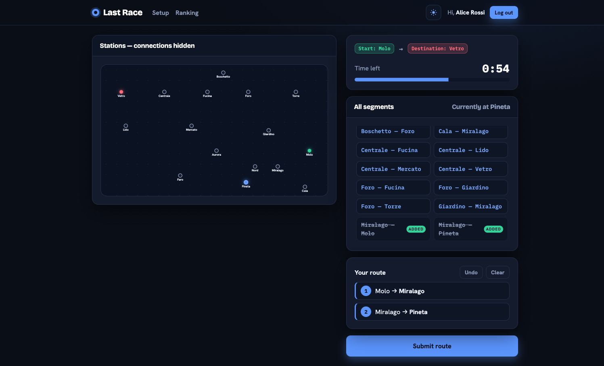

# Last Race

## Server-side

### HTTP APIs

| Method & path | Auth | Request | Response |
|---------------|:----:|---------|----------|
| `POST /api/sessions` | — | `{username, password}` | `200 {id, username, name}` · `401` on bad credentials |
| `GET /api/sessions/current` | — | — | `200 {id, username, name}` if logged in · `200 null` if anonymous (session-state probe) |
| `DELETE /api/sessions/current` | session | — | `204` (logout) |
| `GET /api/network` | session | — | `{stations[], lines[], segments[], interchanges[]}` — full map (lines included), for Setup |
| `POST /api/games` | session | — | `201 {id, start, destination, stations[], segments[]}` — start/dest assigned ≥3 apart; **segments carry no line info** (Planning) |
| `POST /api/games/:id/route` | session | `{route:[{from,to},…]}` | `{valid:true, status, score, steps[]}` after validate+simulate, or `{valid:false, reason, score:0, status:'failed'}` |
| `GET /api/ranking` | session | — | `[{username, name, bestScore}]` (best score per user, desc) |

Objects: **station** `{id,name}` · **line** `{id,name,color,stations:[id…]}` · **segment** `{from,to}` (+`lines:[id…]` on the full map) · **step** `{from,to,event:{description,effect},coinsAfter}`.

### Database tables
| Table | Purpose |
|-------|---------|
| `stations` | The network's stations (unique names). |
| `lines` | Metro lines (unique name + colour). |
| `line_stations` | Ordered stops per line (`position`). **Segments and interchanges are derived from this** — not stored. |
| `events` | Pool of random events (`effect` in −4..+4) applied per hop. |
| `users` | Registered users; password kept as salted **scrypt** hash + salt (never plaintext). |
| `games` | One row per game (`pending`→`completed`/`failed`); stores final score. Ranking = `MAX(score)` per user. |

## Client-side

React 19 + Vite SPA (dev mode, Strict Mode on), `react-router-dom` + `react-bootstrap`. All navigation is
client-side (`<Link>`/`useNavigate`); all `fetch` lives in `src/API.js` (`credentials:'include'`,
`response.ok` checked before `.json()`). A **light/dark theme** (React Context, persisted) skins the whole
app via a class on the app wrapper — toggled from the header.

### Routes
| Path | Access | Screen / purpose |
|------|--------|------------------|
| `/` | public | **Setup.** Instructions for everyone; the full coloured network map + "Start a new game" only when logged in (anonymous users see instructions only). |
| `/login` | public | Controlled login form (redirects home if already logged in). |
| `/play` | logged-in | The game in one route: **Planning** (90s timer; edge-less map + the full list of all segments; build a route by selecting segments in sequence — incomplete/invalid allowed; auto-submit on timeout) → **Execution** (reveal each hop's event + running coins) → **Result** (final score, play again). |
| `/ranking` | logged-in | Best score per registered user, descending. |
| `*` | — | Redirects to `/` (unknown URL, no reload). |

### Main components
- **App** — auth-loading gate; renders `NavHeader` + the routes.
- **AuthProvider** / `useAuth` (`AuthContext`) — current user; `login`/`logout`; rehydrates the session at mount via `GET /api/sessions/current`.
- **ThemeProvider** / `useTheme` (`ThemeContext`) — light/dark colour theme (persisted), applied declaratively via a class on the app wrapper.
- **NavHeader** — top navigation, greeting, logout, light/dark theme toggle.
- **ProtectedRoute** (`RequireAuth`) — guards `/play` and `/ranking`.
- **LoginPage** — controlled, validated username/password form.
- **SetupPage** — instructions + (logged-in) network map and "Start a new game".
- **NetworkMap** (+ **MapLine**, **MapStation**) — declarative SVG map; coloured `setup` mode, edge-less `planning` mode (stations + names only — connections hidden).
- **PlayPage** — owns one game's lifecycle (Planning → Execution → Result phase state).
- **PlanningBoard** — the route builder: map, **CountdownTimer**, **SegmentList** (the full list of all segments), **RouteTimeline**.
- **ExecutionPlayer** — reveals the ride one stop at a time with the running coin total.
- **ResultPanel** — final score (0 for failed/negative) + "Play again".
- **RankingPage** / **RankingTable** — the ranking (current user highlighted).
- **Instructions**, **LoadingSpinner** — shared UI.
- `useCountdown` (hook) — the 90-second one-shot timer driving the auto-submit.

## Overall
### Screenshots

**General ranking page**

**During a game (Planning — the edge-less map + the full list of segments; build a route before the 90s timer runs out)**

### Registered users (for testing)
| username | password |
|----------|----------|
| `alice` | `password` |
| `bob` | `password` |
| `charlie` | `password` |

### Use of AI
AI assistance was used during development mainly for the front-end part of the project. In particular, it helped with organizing React components, improving the user interface, refining the client-side routing structure, and reviewing the interaction flow between the setup, planning, execution, result, and ranking pages. The backend logic, including the database design, API structure, authentication, route validation, and game simulation, was reviewed and understood manually. All AI suggestions were checked, adapted, and tested against the official exam requirements and the course material.